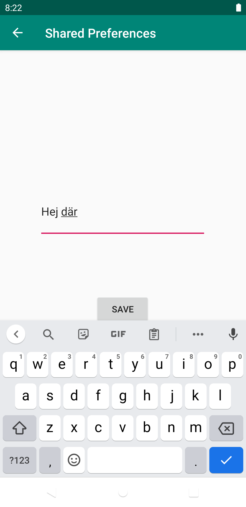
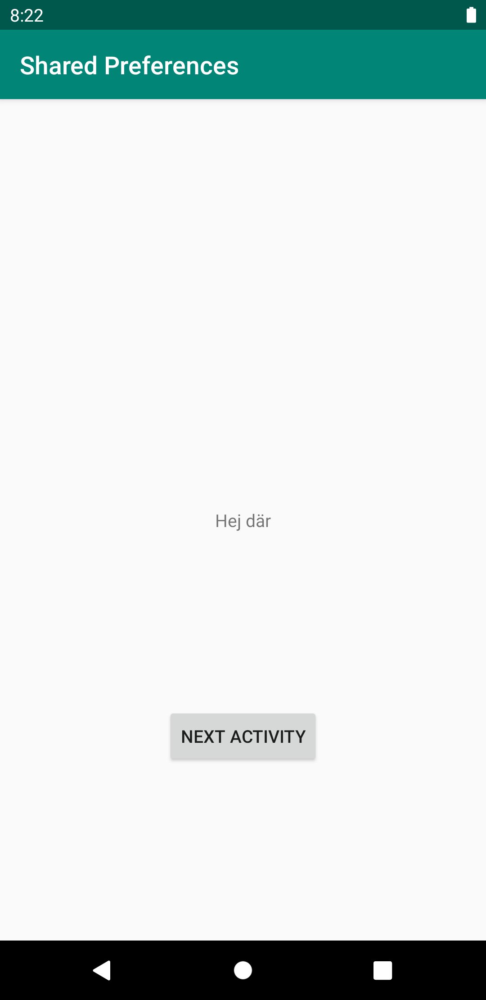

# Rapport
I denna uppgift har jag genom getSharedPreferences sparat data som skrivits in i den andra aktivitetens EditText och gjort så att den visas i main aktiviteten när man återgår til lden sidan igen.
Main aktiviteten har en textView och en knapp. TextViewn visar det senaste som sparats till SharedPreferences objectet när funktionen onResume kallas. Innuti Second activity så finns den en knapp och en EditText.
Det som finns innuti EditText när knappen trycks sparas till samma SharedPreference som i main preference. 

Koden nedan visar metoden onResume, något som kallas när des aktivity igen visas för användaren.
Själva koden identifierar en TextView och genom getSharedPreferences skriver vi data till den. SharedPrerefenses användr Key-value pair för att spara datan.
Så i detta fallet är nyckeln "MyAppPreferenceString" och skulle den vara tom skrivs det då ut "No preference found." istället.
```
 @Override
    protected void onResume() {
        super.onResume();
        TextView prefTextRef = findViewById(R.id.textView);
        prefTextRef.setText(myPreferenceRef.getString("MyAppPreferenceString", "No preference found."));
    }
```


  
